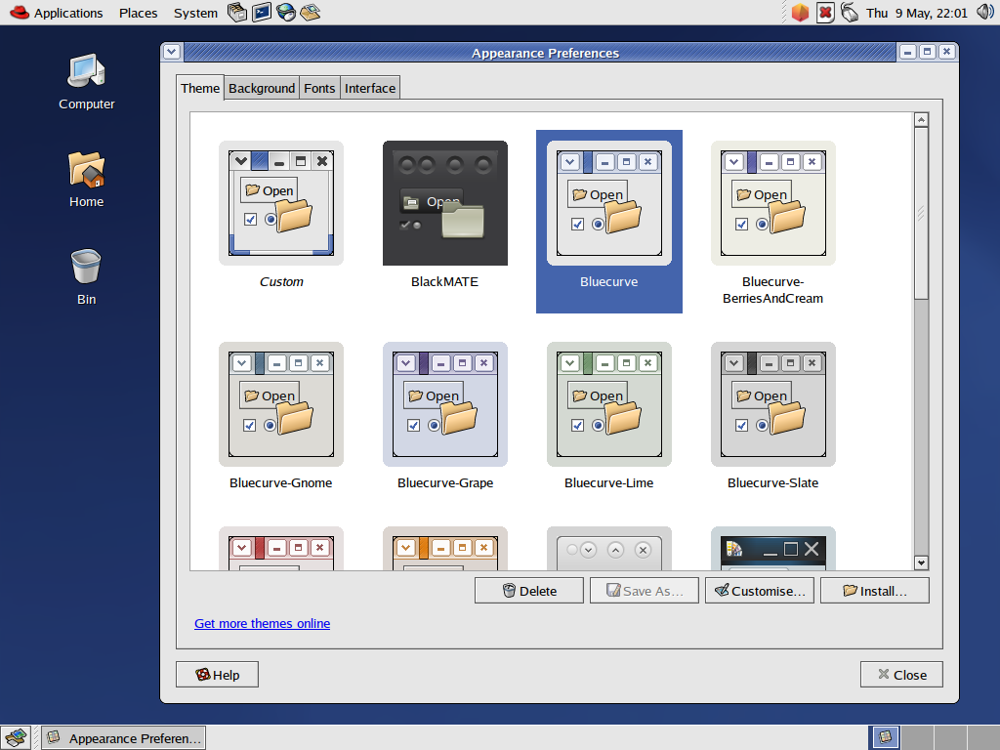

# Bluecurve GTK 3
Red Hat Bluecurve theme ported over to GTK 3. Designed for the MATE desktop environment.


## Includes
- GTK 3 theme, forked from [Blueshell](https://github.com/Rakksor/Blueshell) and modified to make the theme better resemble the original GTK 2 theme and updated to include all of the color schemes that were included with the Bluecurve theme in early versions of Fedora.
- GTK 2 engine and theme, source code is provided by Red Hat / Fedora: [bluecurve-gtk-themes-1.0.0-29.fc37.src.rpm](https://dl.fedoraproject.org/pub/fedora/linux/releases/37/Everything/source/tree/Packages/b/bluecurve-gtk-themes-1.0.0-29.fc37.src.rpm)
- Original Bluecurve Metacity themes updated to resolve issues arising from using old metacity themes on newer versions of MATE.
- Original Bluecurve XFWM4 theme.
- Bluecurve icon and cursor set.
- Luxi font family (fonts used originally in Red Hat 8-9 and early versions of Fedora and RHEL).
- Wallpapers that shipped with Red Hat 8-9 and early versions of Fedora, some of which were updated to widescreen by myself.

## Installation
### 1. Install GTK 2 engine (required)
If on x86_64, copy `engine/x86_64/libbluecurve.so` to `/usr/lib64/gtk-2.0/2.10.0/engines`
```bash
sudo cp engine/x86_64/libbluecurve.so /usr/lib64/gtk-2.0/2.10.0/engines
```
If on i686, copy `engine/i686/libbluecurve.so` to `/usr/lib/gtk-2.0/2.10.0/engines`
```bash
sudo cp engine/i686/libbluecurve.so /usr/lib/gtk-2.0/2.10.0/engines
```
> [!TIP]
> If unsure on whether or not your Linux installation is 32-bit (i686) or 64-bit (x86_64), run the command `uname -a`. You are most likely using a x86_64 installation.

### 2. Install icon and cursor set
Copy the contents of the `icons` folder to `/usr/share/icons`
```bash
sudo cp -r icons/* /usr/share/icons
```
### 3. Install theme
Copy the contents of the `theme` folder to `/usr/share/themes`
```bash
sudo cp -r theme/* /usr/share/themes
```
### (Optional) 4. Install Luxi fonts
> [!WARNING]
> Only do this step if your distribution doesn't include the Luxi font family.

First create the directory `/usr/local/share/fonts` if it doesn't exist.
```bash
sudo mkdir /usr/local/share/fonts
```
Next, copy the fonts to the directory.
```bash
sudo cp fonts/*.ttf /usr/local/share/fonts
```


